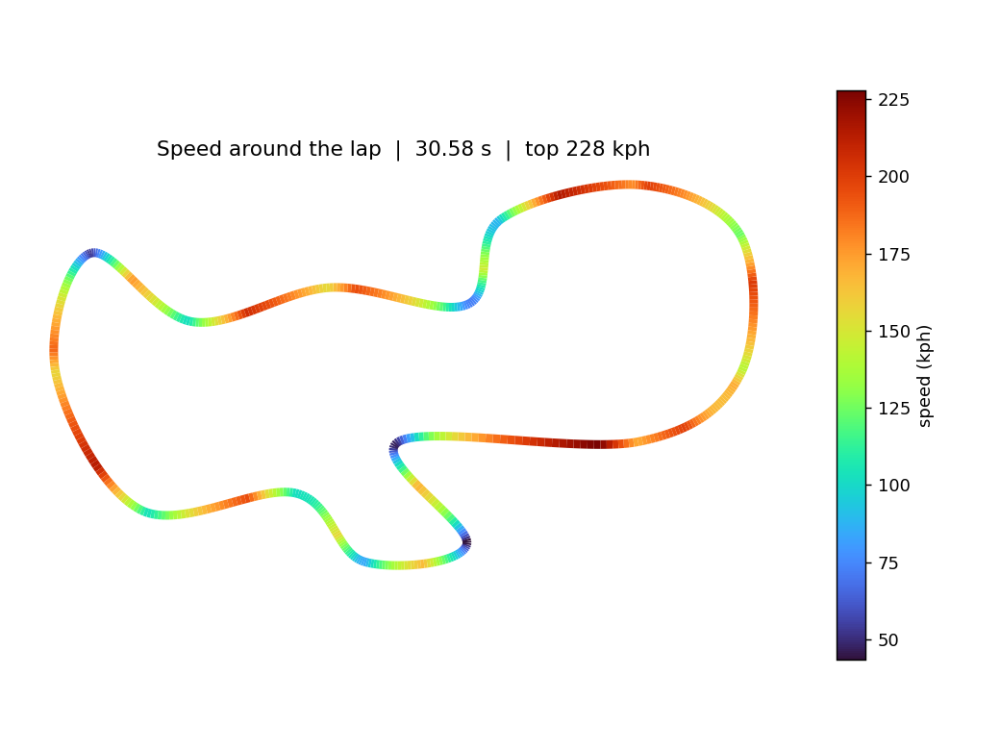

# F1 Lap-Time Simulator


A Formula 1 lap-time simulator using the **quasi-steady-state (QSS)** method real
race engineers use, wrapped in an interactive web app. Change the car's grip,
power, mass and downforce and watch the lap time and the racing-line speed
profile update live.



> The track coloured by simulated speed: deep red on the straights, blue/purple
> through the slow corners. The car is a point mass on a **friction circle** -- a
> fixed grip budget split between cornering and accelerating -- which is what
> makes the corners slow and the straights fast.

**Python backend** (`lapsim/`) does the physics; a **Flask** API exposes it; a
**Canvas** front-end animates a car that physically slows in the corners because
it moves at the simulated speed.

## Tech stack

- **Python 3 + NumPy** — the simulation engine
- **Flask** — JSON API (`/api/simulate`) that runs a lap from the slider values
- **HTML5 Canvas + vanilla JS** — the live, animated visualization
- **Matplotlib** — the static speed-map demo image

## How the simulation works

The lap speed profile is the minimum of three limits at every point on the track:

1. **Corner speed** — the fastest you can hold a corner of curvature `kappa`:
   `mu * g = v^2 * kappa`, so `v = sqrt(mu * g / kappa)`.
2. **Acceleration** — you can't speed up faster than grip and engine allow. The
   **friction circle** couples this to cornering: grip spent turning isn't
   available to accelerate, `a_long = sqrt((mu*g)^2 - a_lat^2)`, further capped by
   engine power (`P/v`) minus aerodynamic drag.
3. **Braking** — you must already be slow enough to brake for the next corner.

A forward pass applies the acceleration limit and a backward pass applies the
braking limit; the two are iterated around the closed loop until the profile
converges. Lap time is `integral of ds / v` around the track.

The track itself is a closed **Catmull-Rom spline** through a handful of corner
markers, which keeps the curvature smooth (raw waypoints give spiky, unusable
curvature).

## Features

- Two circuits (a sanity-check oval and a mixed road course)
- Live sliders for grip, power, mass and downforce/drag
- Speed-coloured track with a car that slows realistically in corners
- Lap time, top speed and live speed read-outs
- Works offline too: if the Flask backend isn't running, the page loads a
  pre-generated default lap so the animation still plays (GitHub Pages friendly)
- Unit tests checking the physics (more grip is faster, no point exceeds its
  corner-speed limit, etc.)

## How to run

```bash
pip install -r requirements.txt

python server.py        # then open http://localhost:5050  (interactive)
python generate_data.py # refresh the static demo + web/data.json
python -m pytest        # or: python tests/test_lap.py
```

## What I learned

- The actual method behind a lap-time sim: it isn't one equation, it's three
  limits (corner / accel / braking) reconciled by forward-backward passes.
- Why the **friction circle** matters — cornering and acceleration compete for the
  same grip, which is the whole reason you can't floor it at apex.
- Wiring a Python physics engine to a browser through a small JSON API, and the
  trick of a static fallback so the demo works without a running server.

## How it could be improved

- Load real circuit coordinates (e.g. from public track outlines) instead of
  hand-placed control points.
- Add tyre degradation and a pit-stop strategy optimizer.
- Model weight transfer and per-axle grip instead of a single point mass.
